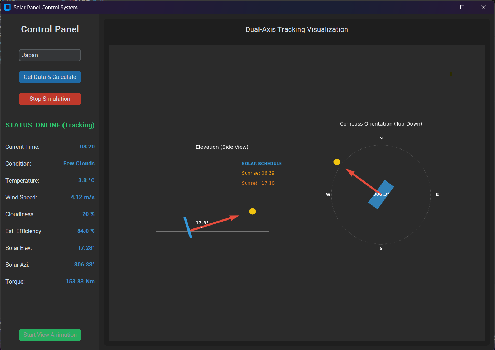
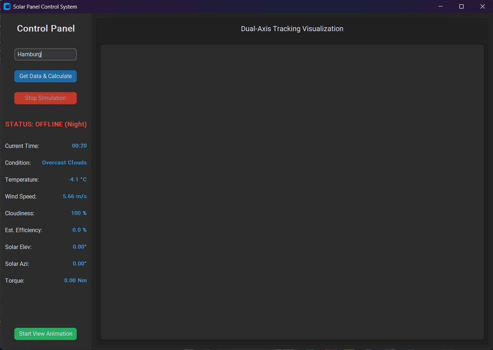

# ☀️ Dual-Axis Solar Tracker Control System

A high-fidelity Python simulation that synchronizes real-world weather data with solar geometry and mechanical load calculations. This tool is designed for engineers and hobbyists to visualize how solar panels should orient themselves for maximum efficiency while calculating the mechanical stress (torque) caused by wind and gravity.


*(Replace this with a screenshot of your app's main window)*

## 🌟 Key Features
* **Live Weather Sync:** Integration with OpenWeatherMap API for real-time cloud cover, wind speed, and temperature.
* **Solar Tracking Algorithm:** Uses Latitude/Longitude to calculate the Sun's **Elevation** and **Azimuth** using the Solar Declination and Hour Angle formulas.
* **Mechanical Load Modeling:** * **Wind Pressure:** Calculates dynamic force using $P = 0.613 \cdot v^2$.
    * **Motor Torque:** Computes the Newton-meters ($Nm$) required to hold the panel against gravity and wind at specific tilt angles.
* **Dynamic UI:** Built with `CustomTkinter` and `Matplotlib` for smooth, hardware-accelerated animations.

---

## 📺 System Demonstration
*Watch the system calculate solar positions and animate the transition from current orientation to the target sun position.*

[Link to your YouTube video or a local MP4 file: "Solar Tracker Simulation Demo"]

---

## 🛠 Engineering Breakdown

### 1. Solar Positioning
The system calculates the exact position of the sun in the sky relative to the panel's location. This ensures the panel is always perpendicular to incoming rays for maximum energy absorption.




https://github.com/user-attachments/assets/802a26ad-f30d-456b-8d01-ab5cb6b9dd21


### 2. Torque & Safety
The application doesn't just track the sun; it evaluates environmental safety. If wind speeds are too high, the calculated torque alerts the user to potential motor strain.
* **Efficiency Logic:** Efficiency is penalized by $0.8\%$ for every $1\%$ of cloud cover.
* **Night Mode:** Automatically parks the panel and zeroes out tracking to save simulated power.


---

## 🚀 Getting Started

### Prerequisites
* Python 3.8+
* An API Key from [OpenWeatherMap](https://openweathermap.org/api)

### Installation
1. **Clone the repo:**
   ```bash
   git clone [https://github.com/yourusername/solar-tracker-system.git](https://github.com/yourusername/solar-tracker-system.git)
